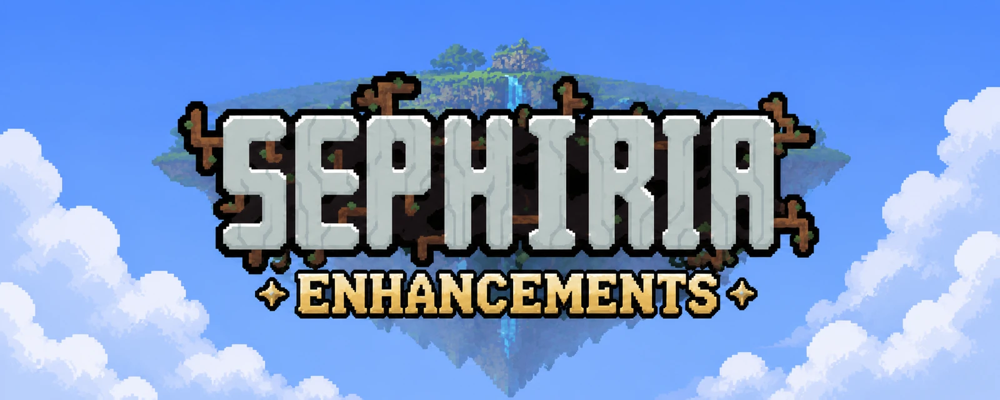

<p align="center">
  
</p>

<p align="center">
  <strong>English</strong> · <a href="./README.zh-CN.md">简体中文</a>
</p>

# Sephiria Enhancements

Native-feeling combat, controls, exploration, multiplayer, and inventory improvements
for Sephiria. Built on the game's AddOns system—no BepInEx installation required.

## Highlights

| Area | What it adds |
| --- | --- |
| Keyboard UI | Keyboard-only navigation and actions for supported menus, maps, routes, rewards, inventories, and message boxes; Tab switches combined UI sections |
| Combat | Rolling DPS, encounter reports, hit streaks, summon attribution, numerical BOSS HP, and clearer ally/enemy visuals |
| Targeting | Optional keyboard attacks with automatic aiming and a rebindable target switch for keyboard or gamepad |
| Exploration | Hidden-room markers, localized town NPC names, a current-floor overlay, and 75%–200% camera distance |
| Solo and co-op | Optional native companion, defeat checkpoints, mid-run joining/reconnect support, and configurable 1–4 player rules |
| Inventory | Experimental one-key arrangement using the Mod's verified solver or Sephiria's artifact-level arranger |

Keyboard support is designed for fast, mouse-free menu flow, including speedrun-style
play, while continuing to follow Sephiria's current semantic actions and player rebinds.

The Mod keeps its settings, shortcuts, and prompts inside Sephiria's native UI. Features
that change gameplay—automatic targeting, the native companion, and developer tools—are
disabled by default.

## Install

1. Exit Sephiria.
2. Download the ZIP and `SHA256SUMS.txt` from the
   [latest release](https://github.com/0xMashiro/SephiriaEnhancements/releases/latest).
3. Verify the ZIP checksum.
4. Extract it into the folder containing `Sephiria.exe`, merging `AddOns` if asked.
5. Start the game and open
   `Options → Gameplay → SEPHIRIA ENHANCEMENTS · by 0xMashiro`.

Expected layout:

```text
Sephiria\
  AddOns\
    SephiriaEnhancements\
      metadata.json
      SephiriaEnhancements.dll
      0Harmony.dll
      THIRD-PARTY-NOTICES.txt
```

## Controls

Bindings appear under `SEPHIRIA ENHANCEMENTS SHORTCUTS` in Sephiria's keyboard and
gamepad controls.

| Action | Default |
| --- | --- |
| Switch locked target | Middle mouse or `L`; right-stick press on gamepad |
| Toggle current-floor overlay | `M` |
| Open/close the latest combat report | Tap `F7` outside combat |
| Hide/restore damage statistics | Hold `F7` for 0.5 seconds |
| Arrange the open backpack (experimental) | `F8` |
| Secondary UI action | Sephiria's current `UI/ThrowItem` binding |
| Rotate or favorite item | Sephiria's current `UI/RotateItem` binding |
| Engrave tablet | Native binding, or a conflict-free `Y` fallback |
| Open the optional developer console | Sephiria's native `/` binding |

Native bindings and player rebinds take priority. The Mod does not freeze Sephiria's
current physical keys.

Both statistics gestures use the same rebindable shortcut. With damage statistics
enabled, a report can be reopened after its automatic display expires. Manually
opened reports stay open until dismissed or another fight starts. The latest
report is retained on the current floor until a new report replaces it; changing
floors, defeat, ending the run, or disabling damage statistics clears it. Moving
and attacking alone do not dismiss an automatic report. Hiding the display keeps
recording damage. State changes use the game's text notifications.
Level-up reminders and brief flashes also leave reports visible. Menus, loading,
screen transitions, and cutscenes temporarily hide reports and preserve their
remaining display time; manually opened reports resume without a timeout.

## Important behavior

- Inventory arrangement is experimental. It reads the installing player's synchronized
  inventory and applies changes through normal game operations; it never edits save
  files directly.
  The Mod solver preserves verified position effects and left/right modes before
  improving levels and combo targets, except for an artifact's own effects when it
  is explicitly excluded. Position-effect values, offsets and thresholds are read
  from the running game. Conservative comparison also preserves the lower bound
  of negative stats, so some upgrades with additional costs may be rejected.
  Unreadable or unverifiable mechanics stop optimization. Refresh order for multiple
  sources of the same-row companion mode is not yet supported.
- Defeat retry restores the selected floor-entry or BOSS checkpoint. Online use requires
  Sephiria's rejoin/midsave support.
- Mid-run access is host-controlled. New players receive new characters and save slots;
  disconnected characters and missed-route rewards are not transferred.
- Multiplayer rule presets affect 1–4 connected human participants. Unsupported counts
  and detected multiplayer extensions keep ownership unless stacking is explicitly enabled.

## Verify a release

From the directory containing the downloaded files:

```powershell
$zip = Get-ChildItem -LiteralPath . -Filter 'SephiriaEnhancements-*.zip' |
    Select-Object -First 1
Get-FileHash -LiteralPath $zip.FullName -Algorithm SHA256
Get-Content -LiteralPath .\SHA256SUMS.txt
```

Confirm that the hash and filename match before extracting. A checksum proves that the
download has not changed; it does not guarantee code safety.

## Build from source

Requirements: PowerShell, the .NET SDK selected by `global.json`, and a legally installed
copy of Sephiria. Game assemblies are read from that local installation and are not
redistributed by this repository.

From the repository root, run the portable checks:

```powershell
& .\scripts\test.ps1
```

Build against the folder containing `Sephiria.exe`:

```powershell
& .\scripts\build.ps1 -GameDir "C:\Games\Sephiria"
```

Create a local ZIP and `SHA256SUMS.txt` under the ignored `artifacts/` directory:

```powershell
& .\scripts\package.ps1 -GameDir "C:\Games\Sephiria"
```

Contributions should keep game-facing code at the integration boundary, use one
canonical term across code and player text, and add a portable model check when policy
can be tested without private game assemblies. Never commit game files, generated API
stubs, decompiled sources, logs, local paths, or build output.

## License

Sephiria Enhancements is released under the [MIT License](./LICENSE).
Copyright (c) 2026 0xMashiro.
